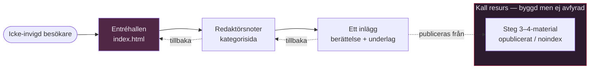
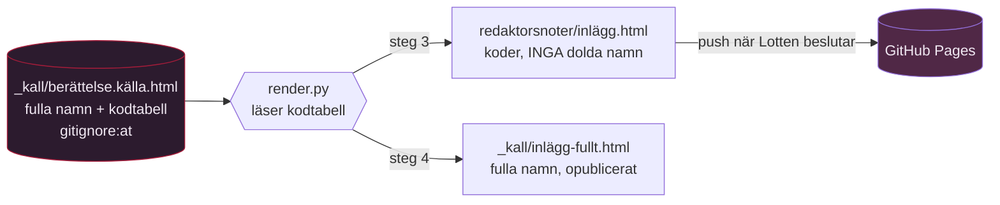
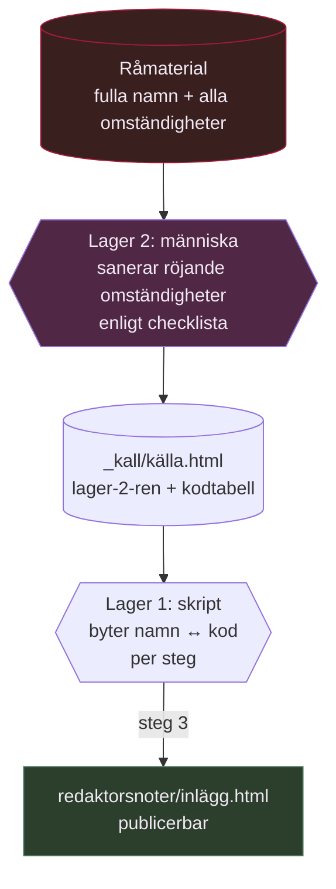

# 📐 Arkitekturförslag — Redaktörsnoter som kampanjbärare (Kandidatur 2027)

> **ID**: T0.4 — bärande informationsarkitektur för TheLipstickWeb
> **Skapad**: 2026-06-19
> **Författare**: 📐 Frances Lloyd Wright, System Architect
> **Modell**: fluff/azure-claude-opus-4-8
> **Status**: Förslag — väntar Lottens beslut på de öppna frågorna
> **För**: 🦞 Velvet (uppdragsgivare), 🛰️ Kepler (framtida implementatör)

---

## 🎯 Sammanfattning för den som har bråttom

Sajten är ett välbyggt hus. Token-systemet bär redan ljust/mörkt och flytande layout — jag river ingenting och bygger inte om det. Tre saker behöver lösas, och bara ett av dem är genuint arkitektoniskt:

1. **Navigeringen** (lätt): tillbakapilen finns redan i `style.css` och i mallen — den glömdes bara på de två redan byggda inläggssidorna. Jag gör den till en obruten konvention i mallen.
2. **Transparenstrappan** (medel): löses med mappstruktur + `noindex` + ett opublicerat utkastlager. Ingen ombyggnad mellan steg.
3. **Anonymiseringen** (svår — kärnan): jag rekommenderar **en källa, två renderingar** via ett litet pre-publiceringsskript. Men anonymisering har **två lager** (Lottens fynd): namnersättning (skriptet löser) och röjande omständigheter / *quasi-identifiers* (kräver mänsklig redaktion — "ordförande för Uppsala Missionskyrka" röjer personen även med namnet utbytt). Sektion 2 och 2b nedan.

**Kärnrekommendation i en mening:** håll *en* sanningskälla per berättelse och låt en lättviktig byggmekanism rendera steg 3 (anonymiserat) och steg 4 (fullt) ur den — så att de två skicken aldrig kan divergera, men inse att skriptet bara byter namn; de röjande omständigheterna måste en människa sanera i källan innan render.

---

## 🏛️ Hur jag ser huset

Jag börjar utifrån, med den som går in genom dörren. Så här ser flödet ut för en besökare — och var kampanjens material lever i det.



Tre rum, alla redan byggda i grova drag:

- **Entréhallen** (`index.html`) — landningssidan, väven av kategorier.
- **Redaktörsnoter-kategorin** (`redaktorsnoter/index.html`) — listan av inlägg, *kampanjens hem*.
- **Inläggen** (`redaktorsnoter/*.html`) — den enskilda berättelsen med sitt underlag.

Det kampanjen tillför är inte ett nytt hus. Det är ett **opublicerat förråd** bredvid det publicerade — den kalla resursen — och en disciplin för hur material flyttas därifrån ut i ljuset, steg för steg.

> **Window to the garden:** det ställe där systemet öppnar sig är inläggssidan. Det är där en icke-invigd möter berättelsen och, om allt sitter rätt, blir genuint upprörd och själv börjar prata. Allt annat i arkitekturen finns för att skydda och bära just det mötet.

---

## 1. 📁 Föreslagen struktur

### Vad som redan finns och bevaras

```text
truelipstick.github.io/
├── index.html              entréhall (orörd)
├── style.css               token-systemet (utökas, rivs aldrig)
├── mall/
│   └── artefakt-mall.html   ← navigeringskonventionen landar här
├── redaktorsnoter/          ← kampanjens hem (finns)
│   ├── index.html           kategorisidan (finns, har redan backlink)
│   ├── fas1-parallellsparen.html
│   └── fas2-processen.html
└── losa/                    olistade sidor (noindex) — bevaras
```

### Vad kampanjen tillför

Jag föreslår **ingen ny toppkategori**. Redaktörsnoter är redan rätt hem, och att uppfinna en parallell struktur skulle bara skapa två ställen där samma material kan hamna. I stället tre tillägg:

```text
TheLipstickWeb/
├── _kall/                   ← NYTT: opublicerat förråd, .gitignore:at
│   └── redaktorsnoter/
│       └── <berattelse>.källa.html   en källa per berättelse (steg 4-fullt)
├── redaktorsnoter/
│   └── (renderade inlägg — genererade ur _kall, eller handskrivna)
└── mall/
    └── artefakt-mall.html   ← navigering + anonymiseringskonvention inbyggd
```

| Tillägg | Vad det är | Varför |
| ------- | ---------- | ------ |
| `_kall/` | Opublicerat källager, **gitignore:at**, ligger i workspace men pushas aldrig | Den kalla resursen. Steg 3–4 finns byggda här utan att vara live. Underscore-prefix signalerar "icke-publik" och Jekyll-konvention (även om `.nojekyll` är på) |
| Renderade inlägg | Det som faktiskt ligger i `redaktorsnoter/` och pushas | Det enda publika. Genereras ur `_kall/` eller skrivs för hand för enkla inlägg |
| Utökad mall | Navigering + anonymiseringsmarkup som standard | Så att inget inlägg någonsin glömmer dörren tillbaka eller hårdkodar ett namn |

Detta respekterar README:s regel om att inget känsligt material lever i sajt-repot: `_kall/` är gitignore:at, precis som konfliktarkivet.

---

## 2. 🎭 Lösning på anonymiseringsproblemet (kärnan)

### Problemet, exakt formulerat

Materialet ska kunna visas i **två skick** ur *samma berättelse*:

- **Steg 3** — anonymiserat: huvudaktörer namnges, uppgiftslämnare (K-koder) och perifera personer döljs bakom koder (`SL3`, `SL4` …).
- **Steg 4** — fullt: alla namn.

Kravet: **ingen underhållen dubblett som kan divergera.**

### ⚠️ Det finns TVÅ anonymiseringslager, inte ett (Lottens fynd 2026-06-20)

Min första analys löste bara halva problemet. Lotten pekade på röstmemo-transkriberingen (`losa/20260609-rostmemo-transkribering.html`) och en avgörande insikt: **det räcker inte att byta ut namn.** Exemplet är `PJ`, som i texten säger sig vara ordförande för Uppsala Missionskyrka och "den i styrelsen som sitter nära Stockholm". Även med namnet utbytt mot en kod är han trivialt identifierbar.

Detta delar anonymiseringen i två **fundamentalt olika** operationer:

| Lager | Vad det är | Var det sitter | Kan ett skript lösa det? |
| ----- | ---------- | -------------- | ------------------------ |
| **1 — Namnersättning** | Byt `Per Johan Råsmark` → `PJ` | Strukturerat (`<span class="name">`) *och* fritext | **Ja** — deterministisk sök-och-ersätt via kodtabell |
| **2 — Röjande omständigheter** (*quasi-identifiers*) | "ordförande för Uppsala Missionskyrka", "nära Stockholm", "-11, -12, -13", namngivna tredje personer (`Clas Svahn`, `Mikael Ingemyr`) | Inbäddat i den löpande meningen, oförutsägbart | **Nej** — kräver mänsklig redaktionell bedömning |

Lager 2 är det farliga, av två skäl: det går inte att automatisera bort, och det är osynligt för den som bara tänker "har jag bytt namnen?". En kod skyddar namnet men inte *meningen runt namnet*. Två harmlösa uppgifter (yrke + ort) pekar tillsammans ut en individ lika säkert som ett personnummer.

**Konsekvens för arkitekturen:** källfilen i `_kall/` måste bära **redaktionell anonymisering redan inbyggd** för det som lager 2 kräver. Skriptet hanterar lager 1 (namn↔kod) mekaniskt; lager 2 är ett mänskligt arbetssteg som sker *när källan skrivs*, inte vid rendering. Detta beskrivs i sektion 2b nedan.

### Vad jag fann i den befintliga koden

Den nuvarande sidan `fas2-processen.html` har anonymiseringen **inbränd manuellt** vid byggtillfället (rad 16: `Anonymisering applicerad: DL→SL3, PJ→SL4, SL→SL5`). Det är exakt divergensrisken: en dag du vill till steg 4 måste någon redigera samma fil för hand och hoppas fånga *alla* förekomster — inklusive de som ligger som fritext i brödtexten (`DK sms:ar → SL3`) och inne i `<script>`-data.

Men jag fann också något hoppfullt: namnen är **redan halvt strukturerade** i markupen:

```html
<div class="person"><span class="badge">SL3</span><span class="name">Styrelseledamot 3</span><span class="role">styrelseledamot</span></div>
```

Det betyder att en datadriven lösning är realistisk — materialet är inte hopplöst sammanflätat fritext.

### Trade-off: hur en källa renderas till två skick

**Kontext:** statisk sajt, GitHub Pages, publikt repo, idag ingen byggprocess. Materialet är delvis strukturerat (person-element), delvis fritext (brödtext, script-data).

**Kvalitetsattribut som står på spel:** divergensrisk (viktigast), läckagerisk, underhållsbörda, hur statisk sajten förblir.

| Option | Pros | Cons | Risk | Effort |
| ------ | ---- | ---- | ---- | ------ |
| **A: Klient-side toggle** (en JS-knapp växlar namn↔kod i webbläsaren) | Ingen byggprocess; en HTML-fil | **Alla namn finns i den publika filen** — "view source" avslöjar uppgiftslämnare oavsett vad skärmen visar | 🔴 Katastrofal: anonymiseringen är en illusion, inte ett skydd | Låg |
| **B: Två handredigerade filer** (en anonym, en full) | Trivialt enkelt; helt statiskt | Två sanningar som divergerar; fritext-koder lätt att missa | 🔴 Hög: precis det Velvet varnar för | Medel (löpande) |
| **C: En källa + pre-publiceringsskript** (källa i `_kall/`, skript renderar steg-3 och steg-4 till publika filer) | En sanning; det publicerade innehåller bara det skicket; fritext hanteras vid render, inte för hand | Inför en lättviktig byggmekanism; kräver ett litet skript | 🟡 Låg om skriptet är enkelt och granskat | Medel (engång) |

**Rekommendation: Option C.** Den är den enda som faktiskt *löser* divergensproblemet i stället för att flytta det. Avgörande poäng om läckage: i Option A ligger de skyddade namnen i den publika HTML:en — anonymiseringen blir kosmetisk. I Option C innehåller den **publicerade** steg-3-filen aldrig de dolda namnen, eftersom skriptet ersätter dem *före* publicering. Källan med fulla namn ligger i gitignore:ade `_kall/` och pushas aldrig.

**Sensitivity:** om materialet vore *ren* fritext utan struktur skulle C bli skört (svårt att veta vad som ska ersättas) och jag skulle luta mot B med en sträng checklista. Men den befintliga koden är redan strukturerad nog att göra C robust. Och om kampanjen aldrig växer förbi 2–3 inlägg är även B försvarbart — då är den manuella bördan liten nog att granska för hand varje gång. **C lönar sig i takt med att antalet inlägg växer.**

### Hur Option C ser ut konkret



Källfilen bär en liten **kodtabell** överst (en kommentar eller ett `<script type="application/json">`-block):

```json
{
  "SL3": { "namn": "[verkligt namn]", "publik_på_steg": 4 },
  "SL4": { "namn": "[verkligt namn]", "publik_på_steg": 4 },
  "K1":  { "namn": "[uppgiftslämnare]", "publik_på_steg": null }
}
```

`publik_på_steg: null` betyder **aldrig** — uppgiftslämnarna (K-koder) får aldrig ett namn oavsett steg. Det är en regel i data, inte en risk i någons minne. Skriptet vägrar helt enkelt skriva ut ett namn för en post med `null`, vilket gör skyddet strukturellt snarare än beroende av att någon kommer ihåg det.

Detta är **inte** ett tungt ramverk. Det är ett ~50-raders Python-skript som kör lokalt (`uv run`, enligt workspace-konventionen), läser en källa, byter ut koder mot namn enligt tabellen för det begärda steget, och skriver en ren statisk HTML-fil. GitHub Pages ser fortfarande bara statiska filer — byggmekanismen lever på Lottens dator, inte i Pages-pipelinen.

Men skriptet löser bara **lager 1**. Lager 2 — de röjande omständigheterna — kräver en annan mekanism.

---

## 2b. 🕵️ Lager 2: röjande omständigheter (det skriptet INTE kan göra)

### Varför ett skript inte räcker

Lager 1 är deterministiskt: `Per Johan Råsmark` blir alltid `PJ`, var det än står. Ett skript gör det felfritt.

Lager 2 är omöjligt att automatisera, eftersom det inte finns något mönster att matcha. "Den i styrelsen som sitter nära Stockholm" röjer en person först när läsaren vet att styrelsen är liten och Uppsala ligger nära Stockholm. Ett skript kan inte veta det. Bara en människa som känner materialet kan se att meningen pekar.

Detta är ett **redaktionellt arbete**, inte ett tekniskt. Arkitekturens uppgift är inte att lösa det automatiskt — det går inte — utan att se till att det **inte glöms** och att det **görs på rätt ställe**.

### Var lager 2 hanteras: i källan, en gång

Principen: **källfilen i `_kall/` är redan lager-2-saneradför det steg den är avsedd för.** De röjande omständigheterna skrivs om eller stryks *när källan författas*, av en människa. Skriptet rör dem aldrig — de finns helt enkelt inte kvar i källan att röja.

Konkret för röstmemo-exemplet, vad en redaktör måste göra i källan innan steg 3:

| Röjande passage | Redaktionell åtgärd för steg 3 |
| --------------- | ------------------------------ |
| "ordförande för Uppsala Missionskyrka" | Stryk eller generalisera ("aktiv i en frikyrkoförsamling" — eller bort helt) |
| "den i styrelsen som sitter nära Stockholm" | Stryk ortsangivelsen |
| "ordförande -11, -12, -13" | Stryk årtalen eller grovta ("i början av 2010-talet") |
| `Clas Svahn`, `Dan Larhammar`, `Mikael Ingemyr` m.fl. | Kodas (om de är skyddsvärda) eller behålls (om de är offentliga huvudaktörer) — Lottens beslut per person |
| "tragedin i familjen" | Stryk — perifert och privat |

### Hur detta blir en rutin och inte en engångsbedömning

En checklista i källmallen, så att lager 2 alltid prövas:

```text
LAGER-2-SANERING (mänsklig, vid författande av källan):
□ Yrken/titlar som pekar ut en kodad person?
□ Orter, avstånd, geografiska ledtrådar?
□ Årtal/perioder som smalnar av till en individ?
□ Namngivna tredje personer — skyddsvärda eller offentliga?
□ Privata förhållanden (familj, relationer, hälsa) utan relevans?
□ Unika händelser bara en person kan kopplas till?
```

**Detta är arkitektens viktigaste begränsningsbesked till dig, Lotten:** ingen teknik gör lager 2 åt dig. Skriptet ger falsk trygghet om man tror att "kör render → klart". Därför skriver jag in i designen att **steg-3-publicering kräver en mänsklig lager-2-granskning av källan först** — det är en spärr i rutinen, inte en knapp.

### Två lager, ett flöde



> **Window to the garden — och dess lås:** lager 1 är dörren som öppnar berättelsen för en icke-invigd. Lager 2 är låset som ser till att den som öppnar dörren inte råkar se in i ett rum som skulle peka ut en skyddad person. Båda behövs. Ett skript kan smida dörren; bara du kan avgöra var låset ska sitta.

---

## 3. 🚦 Hur transparensstegen realiseras

Trappan kräver **ingen ombyggnad mellan steg** — bara att rätt fil publiceras vid rätt tidpunkt.

| Steg | Var materialet lever | Hur det publiceras |
| ---- | -------------------- | ------------------ |
| **1 — Diskret** | `_kall/` (gitignore:at) eller konfliktarkivet | Inte på webben alls |
| **2 — Halvöppet** | `losa/<slug>.html` + `noindex` | Olistad sida, delas via direktlänk. README:s losa-rutin, redan byggd |
| **3 — Offentligt anonymiserat** | `redaktorsnoter/inlägg.html` (steg-3-render) | Listas i kategorin, fortfarande ev. `noindex` tills Lotten vill indexeras |
| **4 — Fullt** | samma sökväg, steg-4-render ersätter steg-3-filen | Skriptet renderar om med fulla namn; `noindex` tas bort |

Den viktiga egenskapen: **övergången 3→4 är att köra om skriptet med `--steg 4` och pusha** — inte att redigera en sida för hand. Utlösaren är ditt beslut, inte en kalender, precis som uppdraget säger. Sidan kan ligga byggd i `_kall/` i steg-4-skick långt innan den publiceras — kall resurs, laddad men ej avfyrad.

`noindex` (som `fas2` redan bär, rad 6) är spaken för synlighet i sökmotorer. Mappstruktur och listning i kategorin är spaken för synlighet på sajten. De är oberoende — du kan ha en sida live men osökbar, eller byggd men opublicerad.

---

## 4. 🔧 Byggmekanism — behövs den?

**Kort svar: ja, en mycket lätt sådan — men bara för anonymiseringen, och bara lokalt.**

För enkla inlägg utan anonymiseringsbehov: **ren handskriven HTML räcker**, precis som idag. README:s rutin står oförändrad.

För inlägg som ska bära steg 3↔4 utan divergens: ett litet lokalt renderingsskript (Option C) är det ärliga svaret. Jag vill vara tydlig med *varför* jag bryter mot "statiskt först":

- Det statiska kravet gäller **det som GitHub Pages serverar**. Det förblir 100 % statiskt — Pages ser bara färdiga HTML-filer.
- Byggmekanismen lever **på Lottens dator**, inte i en CI-pipeline eller en Pages-byggprocess. Den är ett verktyg för att *producera* statiska filer, inte en runtime-server.
- Alternativet — att hålla statiskheten "ren" genom att handredigera två versioner — köper renhet med exakt den divergensrisk uppdraget bad mig eliminera. Det är fel köp.

> *Detta lager — behöver vi det? Ja, men bara här. För allt annat än anonymiserat material är skriptet onödig komplexitet och ska inte användas. Bygg det när första steg-3↔4-inlägget behövs, inte tidigare (YAGNI).*

---

## 5. 🧭 Navigeringskonvention

### Diagnosen

Bristen är inte att mönstret saknas. `.backlink` finns i `style.css` (rad 101–109), fungerar i ljust/mörkt och är flytande. Kategorisidan använder den. **Mallen** har den (`mall/artefakt-mall.html` rad 14). De två redan byggda inläggssidorna (`fas1`, `fas2`) skrevs bara utan att ärva den. Entrén byggdes; dörren tillbaka glömdes på just de två rummen.

### Konventionen jag föreslår

**Brödsmulor, inte bara en pil.** En enkel tillbakapil säger *vart* men inte *var man är*. För en kampanj som växer vill du att en icke-invigd som landar direkt på ett inlägg (via delad länk) genast förstår sammanhanget. Brödsmulan ger både orientering och två vägar tillbaka:

```text
💄 Hem  ›  Redaktörsnoter
```

Placerad **uppe i vänstra hörnet**, som du önskade — vilket är precis var `.backlink` redan landar (den har `margin-bottom: 2.5rem` och ligger först i `.wrap`). 

**Mallen är generisk, brödsmulan ska därför vara en platshållare** (Futabas observation 2026-06-20 — se nedan). I `mall/artefakt-mall.html` står kategori-länken som `../KATEGORI/` med texten `Kategori`, som varje inlägg byter ut. För *Redaktörsnoter-inlägg* blir den ifyllda formen:

```html
<nav class="crumbs" aria-label="Brödsmulor">
  <a href="../">💄 Hem</a><span aria-hidden="true">›</span><a href="../redaktorsnoter/">Redaktörsnoter</a>
</nav>
```

Notera `href="../redaktorsnoter/"`, inte `./`. Inläggssidan ligger *i* kategorimappen, så `../<kategori>/` är det explicita och robusta valet — det matchar mallens befintliga `.backlink`-konvention (`../handelser/`). `./` skulle råka fungera men är skörare.

| Egenskap | Hur den uppfylls |
| -------- | ---------------- |
| Uppe vänster | Först i `.wrap`, ärver `.backlink`-positionen |
| Ljust/mörkt | Använder `--rouge`/`--mauve`-tokens, aldrig hårdkodat |
| Mobil/dator | Mono-text, radbryter naturligt; ingen fast bredd |
| Skalar | Två länkar (hem + kategori) räcker oavsett hur många inlägg som tillkommer |
| Aldrig glömd | Sitter i mallen; varje nytt inlägg ärver den |

**Beslutat av Lotten (2026-06-20):** full brödsmula (`💄 Hem › Redaktörsnoter`). Orienteringen väger tyngre än enkelheten — en icke-invigd som landar direkt på ett inlägg ska genast se var hon är.

### En liten stil-utökning behövs

`.crumbs` finns inte i `style.css` ännu. Den är trivial att lägga till (ärver `.backlink`-typografin, lägger till separator-styling). **Detta är Keplers/Futabas jobb att implementera** — jag specificerar bara att den ska bo bland tokens, inte hårdkodas i en sida.

### 📝 Rättelse: generisk mall vs. inbränd kategori (Futaba, 2026-06-20)

Min ursprungliga markup-spec hade `Redaktörsnoter` och `./` hårt inbränt. Futaba implementerade det ordagrant (rätt av henne) men flaggade: `mall/artefakt-mall.html` är **alla kategoriers** mall, inte bara Redaktörsnoters — en specifik kategori hör inte hemma som mallens default. Helt korrekt, och samma princip som mallens befintliga `.backlink`-kommentar redan följde. Rättat: mallen bär nu platshållaren `../KATEGORI/` / `Kategori`, och `href` är `../<kategori>/` (inte `./`) av robusthetsskäl. Brödsmulan på de skarpa Redaktörsnoter-sidorna fylls i med `../redaktorsnoter/`. En bra påminnelse om att en spec som blandar *exempel* med *påbud* lätt smittar mallen — exempel ska vara synligt utbytbara.

---

## 6. ✅ Vad som INTE ändras

Jag bekräftar uttryckligen att förslaget respekterar det levande:

- **Live-sajten rörs inte** av detta dokument. Det är ett designförslag; Kepler implementerar senare.
- **README:s rutiner består.** Lägg-till-inlägg, losa/-flödet, ASCII-mappnamn, publiceringsstegen — alla oförändrade. Anonymiseringsskriptet är ett *tillägg* för en specifik sorts inlägg, inte en ersättning av rutinen.
- **De två icke förhandlingsbara kraven** (ljust/mörkt, oberoende mobil/dator) bärs redan av token-systemet. Allt jag föreslår använder befintliga tokens.
- **Inget känsligt material i sajt-repot.** `_kall/` är gitignore:at. Det publika repot innehåller bara renderade, granskade, publicerbara filer — aldrig källan med fulla namn, aldrig konfliktarkivets råmaterial.
- **Befintliga kategorier** (vardagsobservationer, händelser, samtal) rörs inte.

---

## ✅ Lottens beslut (2026-06-20)

Alla fyra öppna frågor är nu avgjorda.

1. **Anonymisering → Option C.** En källa, två renderingar. Bekräftat: Lotten vill uttryckligen undvika allt handredigeringsbehov. Detta är arkitekturens bärande beslut.

2. **När byggs `_kall/` + skriptet → nu, och migreringen av fas1/fas2 ingår.** Se "Migreringsvillkoret" nedan — detta är den viktigaste skärpningen Lotten gjorde.

3. **Navigering → full brödsmula** (`💄 Hem › Redaktörsnoter`).

4. **Befintliga sidor → får brödsmulor, och migreras in i källrutinen.** Inte bara en navfix — se nedan.

### 🔒 Migreringsvillkoret (Lottens fråga, och svaret)

Lotten ställde den skarpaste frågan i hela uppdraget: *"Finns det inte en risk att vi glömmer bort de befintliga sidorna om vi inte för in dem i kall-skript-rutinen?"*

Ja. Och risken är värre än att glömma — det är **två sanningar redan idag**. fas1 och fas2 är handanonymiserade. Om källa-skript-rutinen byggs *bredvid* dem utan att föra in dem uppstår exakt det Option C finns för att avskaffa:

- Den dag fas2 ska till steg 4 finns **ingen källa** att rendera ur. Någon måste jaga `SL3` i brödtext (rad 886), person-element (rad 770) och `<script>`-data för hand — den manuella jakten Option C avskaffar.
- fas1/fas2 blir ett **undantag** från rutinen, och undantag är där divergens föds.

**Regeln, inskriven i arkitekturen:** skriptbygget är inte klart (*definition of done*) förrän fas1 och fas2 har källfiler i `_kall/redaktorsnoter/` och de publika sidorna renderas därifrån. Migreringen är ett villkor, inte en förhoppning — den får inte bli en bortglömd "senare".

> *Skillnaden mellan "vi gör det senare" och "vi glömmer det" är att det står skrivet som ett villkor. Nu står det.*

### 🧪 Testkandidat: röstmemo-transkriberingen (Lottens val 2026-06-20)

Lotten valde `losa/20260609-rostmemo-transkribering.html` som **första skarpa test av kallskriptet** — hon vill publicera den efter "rationalisering av onödigt babbel". Den är ett utmärkt testfall, just därför att den tvingar fram *båda* lagren:

- **Lager 1** (skript): fyra talare med koder (`PJ`, `LK`, `DK`, `LA`) finns redan strukturerade som `data-spk`-attribut och `.spk`-element — skriptet har strukturerad mark att arbeta mot, precis som i fas2.
- **Lager 2** (människa): filen är *tät* med röjande omständigheter — Uppsala Missionskyrka, "nära Stockholm", årtal, och en lång rad namngivna tredje personer (`Clas Svahn`, `Mikael Ingemyr`, `Martin Rundqvist`, `Sven Ove`, `Dan Larhammar`, `Lina`, `Linda`, `Staffan` …). Varje sådant namn kräver ett per-person-beslut: skyddsvärd eller offentlig huvudaktör?

**Som testfall validerar den hela designen:** om rutinen klarar röstmemot klarar den allt. Men den visar också varför lager 2 inte kan automatiseras — "rationalisering av onödigt babbel" och sanering av röjande detaljer är samma mänskliga arbetspass, och det måste ske i källan innan skriptet kör.

**Praktisk ordning för detta testfall (förslag till Futaba):**

1. Skapa `_kall/redaktorsnoter/rostmemo-2026-06-09.källa.html` ur den befintliga losa-filen.
2. Lotten kör lager-2-checklistan på källan (rationalisering + sanering i ett pass).
3. Lotten fattar per-person-beslut om de namngivna tredje personerna (kodtabellen).
4. Skriptet renderar steg-3-versionen till `redaktorsnoter/`.
5. Den gamla `losa/`-filen kan pensioneras eller behållas som steg-2-resurs — Lottens val.

---

## 🔗 Relaterade filer

- `TheLipstickWeb/README.md` — befintliga rutiner (bevaras)
- `TheLipstickWeb/style.css` — token-systemet, `.backlink` rad 101–109
- `TheLipstickWeb/mall/artefakt-mall.html` — dit navigeringskonventionen hör
- `TheLipstickWeb/redaktorsnoter/fas2-processen.html` — referensfall: handanonymisering rad 16, strukturerade person-element rad 770–772
- `.kilo/handoffs/HO-260619-1700-frances-velvet-webbstruktur.md` — uppdraget

---

> *📐 Frances — jag ritade dörren tillbaka och förrådet som hålls kallt. Det svåra var aldrig rummen, utan att låta samma berättelse bära två ansikten utan att bli två berättelser. En källa, två renderingar: huset behåller sin sanning.*
